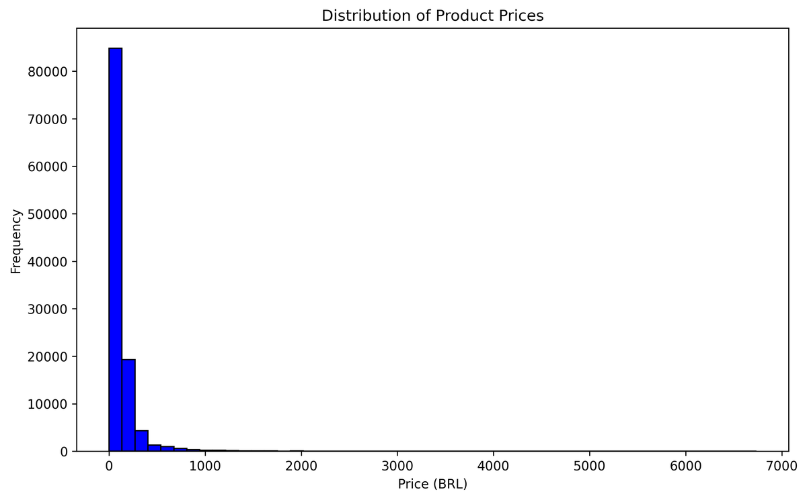
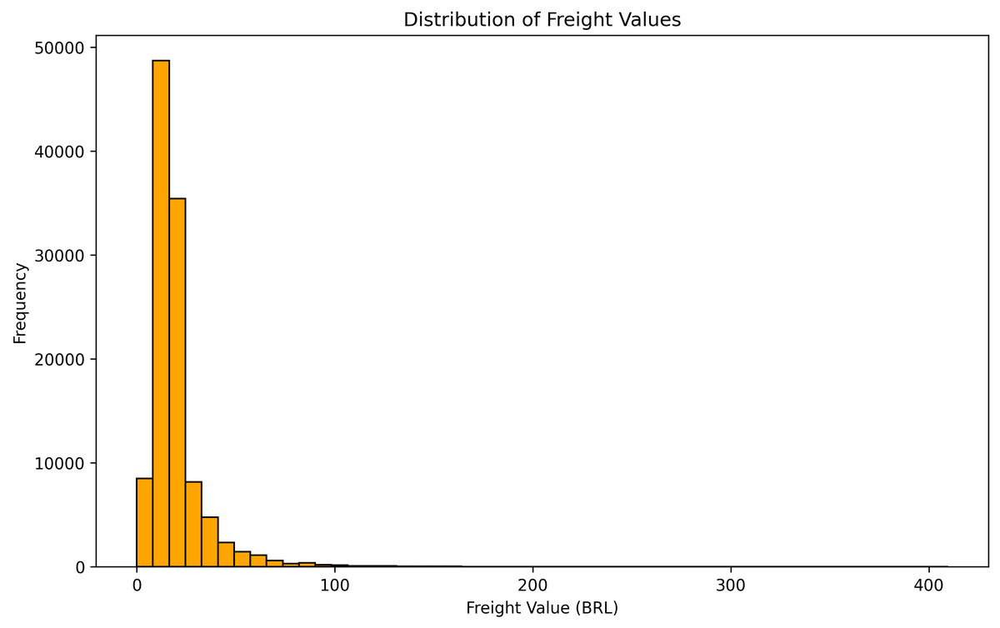
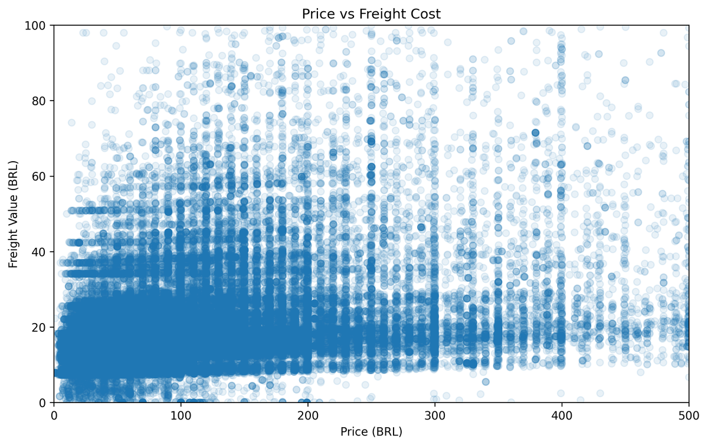
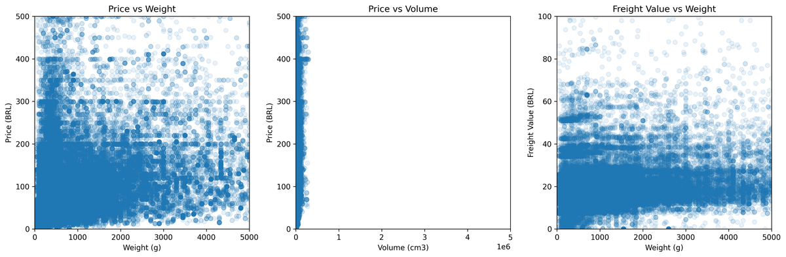
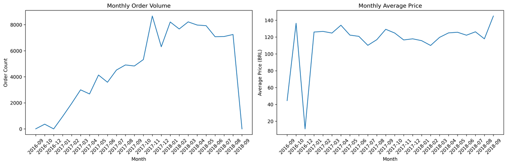
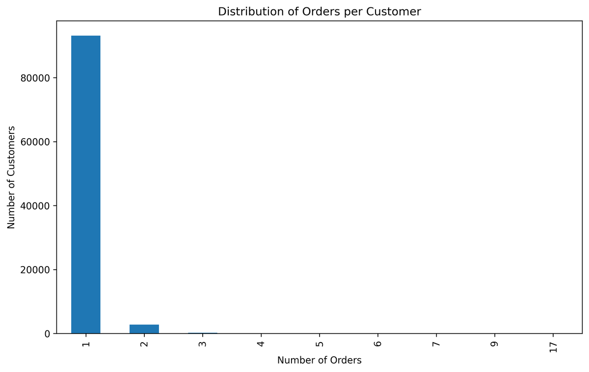
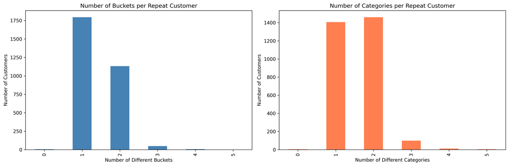
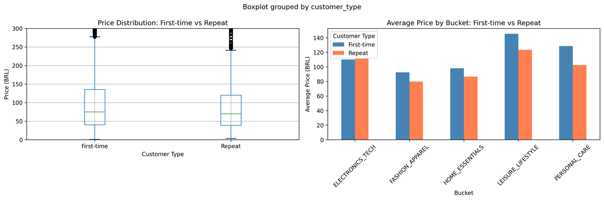
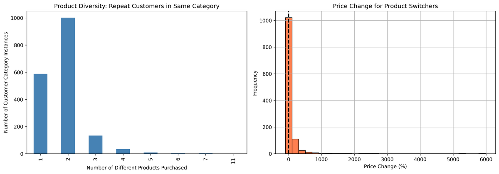

# Data Exploration & Business Context

## Executive Summary

This analysis explores pricing dynamics in the Olist Brazilian e-commerce marketplace using 112,650 transactions from January 2017 to August 2018. Key findings reveal a transactional, low-loyalty marketplace (3.12% repeat rate) where price is driven by value rather than physical attributes (correlation 0.34). Strategic segmentation into 10 product buckets identifies Leisure/Lifestyle as the highest revenue opportunity (3.8M BRL, 29% of total). Additionally, the observed -15% "repeat customer discount" is product mix shift (customers buying cheaper complementary items), not bargain hunting. 90% of same-SKU repurchases occur at identical prices. These insights inform elasticity modeling priorities, with Leisure/Lifestyle presenting the strongest opportunity for pricing optimization due to discretionary nature and value-based pricing.

## 1. Dataset Overview

**Data Source:** Olist Brazilian E-Commerce Dataset (Kaggle)  
**Period:** September 2016 - August 2018 (20 months usable data: Jan 2017 - Aug 2018)  
**Scope:** 112,650 order items across 99,441 orders from 96,096 unique customers

For complete dataset documentation, see [`00_data_overview.md`](00_data_overview.md)

**Key Dataset Characteristics:**
- Multi-platform aggregation (Amazon Brazil, Mercado Livre, B2W, Via Varejo)
- Platform identity not recorded (elasticity estimates reflect aggregated demand)
- Product-level data (32,951 unique SKUs across 71 categories)
- Complete pricing and physical attribute data (weight, dimensions)
- 3,095 sellers creating competitive marketplace dynamics

## 2. Price Distribution Analysis

### 2.1 Overall Price Patterns

**Price Statistics (BRL):**
- Mean: 120.65 (Median: 74.99)
- Standard Deviation: 183.63
- Range: 0.85 - 6,735.00
- **Distribution:** Right-skewed (mean > median)


*Figure 1: Distribution of Product prices*

From the above plot, most products cluster below 200 BRL with a long tail of high-value items (electronics, appliances). The right skew indicates value-based pricing rather than cost-based—expensive items pull the mean up while the median reflects typical purchase prices.

**Extreme Values:**
- Items < 5 BRL: 117 items (0.1% of data) - small accessories, legitimate
- Items > 1,000 BRL: 844 items (0.7% of data) - electronics, appliances, legitimate

**Freight Cost Patterns:**
- Mean: 19.99 BRL (Median: 16.26 BRL)
- Range: 0 - 409.68 BRL
- Standard Deviation: 15.80 BRL
- **Banded structure:** Clear tiers at ~15, ~30, ~45, ~60 BRL
- Suggests standardized shipping rates by zones, not purely weight-based


*Figure 2: Distribution of Freight costs*

## 3. Strategic Product Segmentation

### 3.1 Bucket Creation Rationale

I created 10 strategic buckets based on consumer purchase behavior patterns and product complementarity. This nested structure supports discrete choice modeling (bucket selection → product selection within bucket).

**Segmentation Criteria:**
- Similar purchase motivations within buckets
- Clear cross-bucket trade-offs (budget constraints)
- Sufficient transaction volume for statistical analysis
- Manageable for elasticity estimation

### 3.2 Bucket Performance Analysis

| Bucket | Orders | Revenue (BRL) | Avg Price | % Orders | % Revenue |
|--------|---------|---------------|-----------|----------|-----------|
| **LEISURE_LIFESTYLE** | 26,453 | 3,831,261 | 145 | 24% | **29%** |
| **HOME_ESSENTIALS** | **33,827** | 3,301,515 | 98 | **31%** | 25% |
| **PERSONAL_CARE** | 16,193 | 2,071,139 | 128 | 15% | 16% |
| **ELECTRONICS_TECH** | 17,262 | 1,901,030 | 110 | 16% | 15% |
| **AUTO_TOOLS** | 6,682 | 994,351 | 149 | 6% | 8% |
| **OFFICE_STATIONERY** | 4,208 | 504,904 | 120 | 4% | 4% |
| **SMALL_APPLIANCES** | 993 | 351,412 | **354** | 1% | 3% |
| **FASHION_APPAREL** | 3,734 | 342,649 | 92 | 3% | 3% |
| **FOOD_BEVERAGE** | 1,167 | 67,002 | 57 | 1% | 1% |
| **MISC** | 504 | 41,332 | 82 | <1% | <1% |

### 3.3 Strategic Opportunities

**LEISURE_LIFESTYLE (Top Priority for Optimization):**
- Highest revenue (29% of total) despite 2nd place in volume
- Average price 145 BRL creating a sweet spot of high volume and decent prices
- Discretionary spending and the products are likely elastic
- Categories: toys, sports, watches, gifts, books, music, pet supplies

**HOME_ESSENTIALS (Volume Leader):**
- Highest transaction volume (31% of orders)
- Mass-market appeal (avg price 98 BRL)
- Functional/necessity purchases and the products likely exhibit moderate elasticity
- Competitive market suggests price sensitivity

**PERSONAL_CARE (Brand Loyalty Candidate):**
- Strong revenue (16%) with moderate prices (128 BRL avg)
- Potential brand loyalty dynamics
- Likely inelastic as products in this buckets are consumables and consumers likely have brand preferences

## 4. Price Variation & Marketplace Dynamics

### 4.1 Price Variation by Product

I analyzed the coefficient of variation (CV = std/mean) for products with over 10 orders:

**High Price Variation (CV > 0.3):**
- Indicates seller competition or promotional pricing
- Multiple sellers offering same product at different prices
- Examples: perfumery (0.76), housewares (0.72), consoles (0.60)

**Zero Price Variation (CV = 0.0):**
- Same product sold at identical price across all transactions
- Suggests: price-matching behavior, Minimum Advertised Price (MAP) policies, or single dominant seller
- Examples: furniture_decor (34.99 BRL), health_beauty (100.00 BRL)

**Implication:** Sufficient price variation exists for elasticity estimation, driven by:
1. Seller competition (multiple sellers, different prices)
2. Temporal changes (sellers adjusting prices over time)
3. Product heterogeneity (different SKUs within categories)

## 5. Correlation Analysis: Price Drivers

### 5.1 Price vs Freight (Overall: 0.41)

**Key Observations:**
- Moderate positive correlation (0.41)
- **Clear horizontal banding** at specific freight values (15-20, 30-40, 50-60, 80-100 BRL)
- Weak linear relationship (scattered vertically across all price ranges)


*Figure 3: Price vs Freight Scatter Plot*

From the above plot, Freight follows standardized shipping tiers, not purely price-driven. It is driven by weight of the product, distance travelled, and shipping zones. Furthermore customers see total cost (price + freight) when making a purchasing decision.

**By Bucket:**

- SMALL_APPLIANCES: 0.57 (highest - expensive items are heavy)
- FOOD_BEVERAGE: 0.28 (lowest - standardized packaging, local sourcing)
- Most buckets: 0.41-0.49 (moderate correlation)

### 5.2 Price vs Physical Attributes

**Correlation Matrix:**
```
                   Price    Freight   Weight    Volume
Price              1.00      0.41      0.34      0.30
Freight            0.41      1.00      0.61      0.59
Weight             0.34      0.61      1.00      0.80
Volume             0.30      0.59      0.80      1.00
```

The above table indicates that the price is not a function of weight and volume and is decoupled from physical attributes.


*Figure 4: Price vs Weight, Price vs Volume, and Freight vs Weight Scatter Plot*

**Price vs Weight (0.34 - Weak):**
- Most products clustered at low weight across all price ranges
- $50 items and $400 items can have same weight
- **Price driven by value (brand, features, quality), not weight**

**Price vs Volume (0.30 - Weak):**
- Confirms value-based pricing, not cost-based
- Small products expensive (electronics, jewelry)
- Large products cheap (furniture, bulky goods)

**Freight vs Weight (0.61 - Strong):**
- Freight IS driven by weight (logistics reality)
- But also shows tiered pricing (horizontal bands)

**Strategic Implications:**
1. **High-value, low-weight products** create best margin opportunity (electronics, cosmetics, jewelry)
2. **Bulky, low-price products** create margin challenge (furniture, large appliances)
3. Price elasticity should be estimated independently of freight

### 5.3 Bucket-Level Correlation Patterns

**Price-Weight Correlation by Bucket:**

| Bucket | Price-Weight Correlation | Interpretation |
|--------|--------------------------|----------------|
| **LEISURE_LIFESTYLE** | **0.31** (lowest) | Pure value pricing such as watches, toys, gifts (emotional purchases) |
| ELECTRONICS_TECH | 0.37 | Value-driven (microchips expensive but light) |
| AUTO_TOOLS | 0.37 | Search-driven purchases |
| PERSONAL_CARE | 0.43 | Mix of weight (bottle size) and brand premium |
| FOOD_BEVERAGE | 0.44 | Weight-driven but competitive pricing |
| HOME_ESSENTIALS | 0.48 | Moderate cost-plus (materials and shipping) |
| OFFICE_STATIONERY | 0.51 | Functional, cost-based |
| **SMALL_APPLIANCES** | **0.52** (highest) | Cost-plus pricing (materials and weight dominant) |
| MISC | 0.68 | Physical characteristics drive price |

**Elasticity Predictions (for Week 2):**

**MOST ELASTIC (price-sensitive):**
1. LEISURE_LIFESTYLE (0.31) - Discretionary, value-based, substitutable
2. FOOD_BEVERAGE (0.28 freight correlation) - Commodity-like
3. ELECTRONICS_TECH (0.37) - Research-driven, comparable

**LEAST ELASTIC (price-insensitive):**
1. SMALL_APPLIANCES (0.52) - Functional, feature-driven
2. OFFICE_STATIONERY (0.51) - Business purchases, specific needs
3. HOME_ESSENTIALS (0.48) - Large, considered purchases

## 6. Temporal Patterns & Seasonality

### 6.1 Volume Trends

**Growth Pattern:**
- Sept 2016: approximately 0 orders
- Rapid growth through 2017 (200 to 8,000+ orders per month)
- Peak: Nov 2017 (8,665 orders likely due to Black Friday or holiday season)
- Stable: Jan-Aug 2018 (approximately 7,000-8,000 orders per month)
- Sharp drop: Sept 2018 (likely data cutoff)

### 6.2 Price Stability

**Price Trends:**
- Oct 2016: 136 BRL (small sample and this will be ignored in the analysis)
- Jan 2017: 125 BRL (higher initial prices)
- Feb-Aug 2017: Steady decline to  approximately 110-120 BRL
- Sept 2017-Aug 2018: Stable prices between  approximately 115-125 BRL


*Figure 5: Volume and Price Temporal Plot*

From the above plot I identified that the price data is stable data for 20 months between Jan 2017 and Aug 2018. Additionally, there is no major seasonal price variation. The lack of season price variation is excellent for elasticity analysis as the price changes observed are seller/product decisions, not seasonal promotions. This pattern rules out the seasonal effects on pricing decisions.

### 6.3 Day-of-Week & Monthly Patterns

**Day-of-Week:**
- Saturday: 123.60 BRL (highest - weekend shopping)
- Sunday: 118.46 BRL (lowest)
- Weekdays: 119-122 BRL (stable)
- **Range: Only 4% variation**

**Monthly Seasonality:**
- Highest: September (129 BRL), April (127 BRL), October (126 BRL)
- Lowest: February (113 BRL), January (117 BRL), August (118 BRL)
- **Range: Only 14% variation (113-129 BRL)**

**Implication for Elasticity Estimation:**

**Price variation is not time-driven**
- Can estimate elasticity without complex time controls
- Don't need to worry about "Black Friday bias" or "Christmas premium"
- Cleaner causal identification
- Focus on cross-sectional price variation (across products/sellers)
- Include month fixed effects to control for small seasonal variation

## 7. Repeat Purchase Analysis

### 7.1 Overall Repeat Rate: 3.12%

**Distribution:**
- 93,099 customers made exactly 1 order (96.9%)
- 2,997 customers made 2+ orders (3.1%)
- Maximum: 1 customer with 17 orders (outlier)


*Figure 6: Orders Per Customer*

A critical finding is that this is a low-loyalty and highly transactional marketplace. From the above statistics and from the plot, this is primarily a customer acquisition marketplace, not retention or loyalty platform.

**Possible Reasons:**
1. **Platform aggregation effect** - Customers loyal to platforms (Amazon, Mercado Livre), not sellers
2. **Product mix** - Dominated by durables (furniture, electronics) with infrequent repurchase
3. **Brazilian e-commerce culture** - Price shopping across platforms is norm

**Implications for Pricing Strategy**
- Cannot rely on "loyalty premium" pricing
- Every transaction is essentially first-time buyer behavior
- Competitive pricing is critical (there are no switching costs)
- Focus on acquisition, not retention

### 7.2 Repeat Rates by Bucket

| Bucket | Repeat Customers | Repeat Rate | Rank |
|--------|------------------|-------------|------|
| **FASHION_APPAREL** | 242 | **7.2%** | 1st |
| **FOOD_BEVERAGE** | 59 | **6.1%** | 2nd |
| MISC | 25 | 5.6% | 3rd |
| HOME_ESSENTIALS | 1,426 | 5.3% | 4th |
| PERSONAL_CARE | 599 | 4.1% | 5th |
| LEISURE_LIFESTYLE | 954 | 4.0% | 6th |
| OFFICE_STATIONERY | 133 | 3.7% | 7th |
| AUTO_TOOLS | 216 | 3.7% | 8th |
| ELECTRONICS_TECH | 551 | 3.6% | 9th |
| SMALL_APPLIANCES | 32 | 3.4% | 10th |

**Insights:**

**Fashion leads (7.2%):**
- Consumable nature (seasonal restocking, sizing experiments)
- Low price point (92 BRL avg) and it's easy to repeat purchases
- Impulse/gift purchases

**Food 2nd (6.1%):**
- Expected (consumables)
- Subscription opportunity

**Home Essentials 4th (5.3%):**
- Unexpected for durables
- Sequential purchases (purchasing bed leads to bedding purchases and potentially decor)
- Multi-room needs

**Electronics lowest (3.6%):**
- Expected (infrequent replacement, high-value durables)

### 7.3 Bucket Loyalty

**60% of repeat customers stick to one bucket:**
- 1,796 customers (60.1%) bought from single bucket only
- 1,132 customers (37.9%) explored 2 buckets
- 56 customers (1.9%) shopped 3+ buckets


*Figure 7: Bucket Loyalty*

From the finsings, on average we find a 1.42 buckets per repeat customer

**Interpretation:**
- **Most repeat customers are category-loyal** (customer finds what they need, stick with it)
- **Some exploration exists** (38% cross-bucket shopping)
- **Very few promiscuous shoppers** (<2% shop extensively)

## 8. The "Repeat Discount" Mystery

### 8.1 Initial Finding: Repeat Customers Pay 15% Less

**Price Comparison:**
- First-time customers: 121.31 BRL average
- Repeat customers: 102.74 BRL average
- **Difference: -18.57 BRL (-15.3%)**
- **Statistically significant** (p < 0.0001)

**By Bucket:**
- PERSONAL_CARE: -26.20 BRL (-20.4%) - largest discount
- LEISURE_LIFESTYLE: -22.04 BRL (-15.1%)
- HOME_ESSENTIALS: -11.56 BRL (-11.8%)
- ELECTRONICS_TECH: **+1.19 BRL (+1.1%)** - only premium


*Figure 8: Price comparison between first-time and repeat customers by bucket*

**Initial Hypothesis:**
Repeat customers are bargain hunters who found deals and came back for more.

But this raised a critical question: Are they paying less for the same products (true bargain hunting) or buying different, cheaper products (product mix shift)?

### 8.2 Testing the Hypothesis: Same-SKU Analysis

**Research Question:** When customers repurchase the exact same product_id, do they pay different prices?

**Findings:**
- Only 26% of repeat customers (776/2,997) repurchase exact same SKU
- 854 same-SKU repurchase instances total

**Price Changes for identical Product:**
- **90.3% paid exactly the same price** (0.00 BRL change)
- 5.9% paid less (-0.71 BRL average)
- 3.9% paid more
- **Average change: -0.2%** (essentially zero)

**Top Categories for Same-SKU Repurchase:**
- bed_bath_table (126 instances)
- furniture_decor (109)
- sports_leisure (90)
- computers_accessories (74)

**Conclusion:** No bargain hunting for identical products.

When customers buy the exact same SKU twice, they pay the same price 90% of the time.


*Figure 9: Product Diversity*

### 8.3 The Real Story: Product Mix Shift

**Product Diversity Within Categories:**
- 67% of repeat category purchasers (1,186) buy different products
- Only 33% (588) stick to same product
- Average: 1.82 different products per category
- Median: 2 different products

**Price Changes When Switching Products:**
- 41.4% paid less (traded down to cheaper items)
- 42.8% paid more (traded up to premium items)
- Median change: 0.00 BRL (balanced distribution)
- Mean: +4.19 BRL (skewed by outliers)

**Conclusion:** The -15% "discount" is product mix shift, not bargain hunting.

### 8.4 What's Actually Happening

**Sequential Purchase Journey:**

**First Purchase (Higher Price):**
- Customer discovers category
- Buys **primary/flagship item** (expensive)
- Examples:
  - Home Essentials: Bed frame (500 BRL)
  - Personal Care: Premium anti-aging serum (150 BRL)
  - Leisure: Expensive watch (300 BRL)

**Repeat Purchase (Lower Price):**
- Customer explores category
- Buys **complementary/accessory items** (cheaper)
- Examples:
  - Home Essentials: Bedding (100 BRL)
  - Personal Care: Basic shampoo (30 BRL)
  - Leisure: Pet toy (40 BRL)

This is natural category exploration, not price sensitivity.

## 9. Key Insights & Strategic Implications

### 9.1 Summary of Findings

| Finding | Implication for Pricing |
|---------|------------------------|
| **3.12% repeat rate** | Focus acquisition pricing, not loyalty premiums |
| **Price uncorrelated with weight (0.34)** | Value-based pricing dominates; high-value/low-weight products = best margins |
| **Stable temporal pricing** | Clean elasticity estimation without seasonal confounds |
| **-15% "discount" is product mix** | Don't offer loyalty discounts; focus on cross-sell optimization |
| **90% same-SKU same-price** | No bargain hunting; customers are not deal-seekers |
| **67% switch products in category** | Category loyalty exists; leverage for cross-sell |
| **Fashion/Food highest repeat (7.2%, 6.1%)** | Subscription/loyalty programs viable here only |

### 9.2 Revised Pricing Recommendations

**Wrong Strategy (if we stopped at surface analysis):**
- Offer loyalty discounts to repeat customers
- Assume repeat buyers are price-sensitive
- Focus retention through price cuts

**Correct Strategy (after deep analysis):**

**1. LEISURE_LIFESTYLE (Top Priority):**
- **Strategy:** Optimize primary product pricing plus cross-sell
- **Action:** Bundle complementary items (toy + gift wrap, watch + accessories)
- **Pricing:** Maintain competitive pricing on flagships; volume discounts on accessories
- **Why:** Highest revenue (29%), value-based pricing (0.31 weight correlation), discretionary

**2. HOME_ESSENTIALS (Volume Leader):**
- **Strategy:** Sequential purchase optimization
- **Action:** "Complete the room" bundles (bed + bedding + decor)
- **Pricing:** Competitive on big-ticket items; cross-sell accessories
- **Why:** 31% of orders, sequential purchase pattern evident

**3. PERSONAL_CARE (Brand Loyalty):**
- **Strategy:** Starter kit to refill journey
- **Action:** Premium pricing on discovery sets; subscriptions for refills
- **Pricing:** Premium for kits; volume discounts for basics
- **Why:** Classic consumable pattern; some brand loyalty

**4. ELECTRONICS/TECH (One-Time):**
- **Strategy:** Pure acquisition pricing
- **Action:** Competitive market pricing; no expectation of repeat
- **Pricing:** Match or beat competition
- **Why:** 3.6% repeat rate; quality-driven (small premium acceptable)

**5. FASHION/FOOD (Highest Repeat):**
- **Strategy:** Loyalty programs + subscriptions
- **Action:** Seasonal reminders (fashion), subscribe & save (food)
- **Pricing:** Loyalty rewards; volume discounts
- **Why:** 7.2% and 6.1% repeat rates (2 times overall average)


### 9.3 Hypotheses for Elasticity Testing (Week 2)

**H1: Discretionary vs Essential**
LEISURE_LIFESTYLE has higher price elasticity than HOME_ESSENTIALS (discretionary spending is more price-sensitive than functional needs)

**H2: Value-Based vs Cost-Based Pricing**
Buckets with low price-weight correlation (LEISURE_LIFESTYLE 0.31, ELECTRONICS 0.37) show higher elasticity than cost-driven buckets (SMALL_APPLIANCES 0.52)

**H3: Brand Loyalty Effects**
PERSONAL_CARE shows lower own-price elasticity and lower cross-elasticity within bucket (brand loyalty reduces substitution)

**H4: Quality-Seeking Exception**
ELECTRONICS_TECH and SMALL_APPLIANCES show lower elasticity for repeat customers (quality/reliability concerns reduce price sensitivity)

**H5: Product Mix Confound**
Apparent "repeat customer discount" is product mix shift, not increased price elasticity (test by controlling for product fixed effects)

## 10. Data Quality & Limitations

### 10.1 Strengths
- Large transaction volume (112K+ observations)  
- Stable pricing environment (minimal promotional noise)  
- Natural price variation (seller competition)  
- Complete transaction records (no missing prices)  
- 20 months of stable, mature marketplace data 

### 10.2 Limitations
- Platform identity unknown (cannot separate Amazon vs Mercado Livre)  
- No product names/descriptions (only categories + physical attributes)  
- No brand information (cannot measure brand-specific elasticities)  
- No marketing data (promotions, advertising)  
- Sparse review text (only 41% have written comments)

### 10.3 Analytical Approach

**Working Around Limitations:**
- **Product-level analysis:** Each product_id = unique SKU
- **Price-tier grouping:** Low/mid/high within categories as proxy for quality
- **Seller competition:** Multi-seller products provide price variation
- **Category focus:** Estimate elasticities at product + category levels

**Validity:**
- Results generalize to **multi-platform marketplace dynamics**
- May not apply to: luxury segments, B2B, markets with heavy promotional activity

## 11. Next Steps: Week 2 Roadmap

### 11.1 Elasticity Estimation Focus

**Primary Bucket: LEISURE_LIFESTYLE**
- Highest revenue (29% of total)
- Lowest physical correlation (0.31 - pure value pricing)
- Discretionary spending (likely elastic)
- Sufficient volume for robust estimation (26,453 orders)

**Methodology:**
1. **Log-log regression** (baseline own-price elasticity)
2. **Product fixed effects** (control for heterogeneity)
3. **Time fixed effects** (control for small seasonal variation)
4. **Nested logit** (if time permits - bucket to product choice)

**Controls:**
- Product characteristics (weight, volume, category)
- Seller effects (multi-seller competition)
- Quality signals (review scores)
- Geographic variation (state-level)

### 11.2 Secondary Analyses

**Compare across buckets:**
- HOME_ESSENTIALS (expect moderate elasticity)
- PERSONAL_CARE (expect low elasticity - brand loyalty)
- ELECTRONICS_TECH (expect moderate elasticity - research-driven)

**Segmentation:**
- First-time vs repeat customers (expect similar elasticity given findings)
- Price tiers (low/mid/high within categories)
- Geographic regions (if variation exists)

### 11.3 Expected Deliverables

**Week 2 Output:**
- Own-price elasticity estimates by bucket
- Statistical significance tests
- Robustness checks (different specifications)
- Business interpretation + revenue implications

**Week 3-4:**
- Cross-price elasticities (substitution patterns)
- Optimization recommendations
- Expected revenue impact
- Implementation roadmap

## 12. Conclusion

This exploration reveals a transactional, low-loyalty marketplace where value-based pricing dominates. The key insight—that repeat customers explore product portfolios rather than hunt for bargains—fundamentally reshapes pricing strategy from loyalty discounts toward cross-sell optimization. LEISURE_LIFESTYLE emerges as the top priority for elasticity modeling due to its revenue dominance (29%), value-driven pricing (0.31 weight correlation), and discretionary nature. The stable pricing environment and natural seller competition provide ideal conditions for clean elasticity estimation in Week 2.

**Most Important Finding:**
Contrary to conventional wisdom, repeat customers in multi-platform marketplaces are category explorers, not bargain hunters or brand loyalists. They pay 15-20% less on repeat purchases because they buy cheaper complementary items (product mix shift), not because they demand discounts. Pricing strategy should focus on cross-sell optimization, not loyalty discounts.


